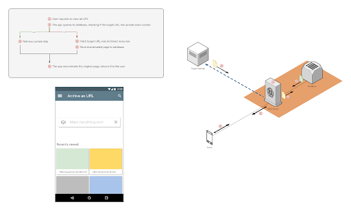

# Archiver - NT208 project

Web archiving is the process of collecting portions of the World Wide Web to ensure the information is preserved in an archive for future researchers, histordians, and the public.

**Archiver** is a simple project that let users archive a website, and view previously taken web snapshots.

## Key features
- Dead simple. Just paste your URL and let it handle the rest.
- Optionally crawl and archive the whole website.
- Snapshots are saved as ISO standard WARC format.
- ...?

## Usage
### Guest users
Just simply paste your URL and press "Go".
- If that URL is already in our database, you will be prompted to select which snapshot you want to view.
- If not, the app will then start archiving that website. You will be redirected to the result after it's done archiving.
Guest users are allowed to make 3 archiving requests a day, and view 10 web snapshots a day.

### Registered users
Registered users enjoys the same functionality as guest users, plus:
- Unlimited archiving requests and snapshot view times.
- Bookmark your favorite snapshots.

## Project structure
This project contains 2 main components: `Frontend` and `Backend`.
### Frontend
Developed using:
- React.js
- Tailwind CSS
- Axios

The frontend is where the user will interact with, and handles talking with backend infrastructure to request actions/fetch data.

### Backend
Developed using:
- Flask (Python)
- MongoDB
- [SingleFile](https://github.com/gildas-lormeau/SingleFile)
The backend will host the app's APIs and main functionalities, such as crawling websites, archiving and retrieving snapshots.

## Developers manual
### Basic operations
- Start all services:  `docker compose up -d`
- View all logs:  `docker compose logs`
  - View only logs from "main-api" service:  `docker compose logs main-api`
- Rebuild "main-api" service after making changes:  `docker compose up -d --build main-api`
- Stop all services:  `docker compose down`

### API flow
**1. Check if URL is already archived**
```
GET /api/archive/is_archived?url=https://www.github.com
```
```
{"status":"not_archived","success":true}
// status = not_archived / archiving / archived / unreachable
```
**2. Start archiving a webpage:**
```
GET /api/archive/do_archive?url=https://www.github.com
```
```
{"msg":"Archiving target site, please wait.","success":true}
```
**3. Keep polling `/api/archive/is_archived` to check for progress, until it either returns `archived` or `unreachable`**
```
GET /api/archive/is_archived?url=https://www.github.com
```
```
{"status":"not_archived","success":true}
```
**4. Get the list of archived snapshots of the requested URL**
```
GET /api/archive/list?url=https://www.github.com
```
```
{
    "snapshot_list": [
        {
            "created_time": "2024-05-11 20:17:42 UTC+0000",
            "snapshot_id": "1715458662.5612893"
        },
        {
            "created_time": "2024-05-07 20:24:11 UTC+0000",
            "snapshot_id": "1715113451.011099"
        }
    ],
    "success": true
}
```
**5. View URL's archived snapshot**
```
GET /api/archive/view_raw?snapshot_id=1715113451.011099
```
```
<!DOCTYPE html> <html> .................
```

### Troubleshooting
- "Have you tried turning it off and on again?"  `systemctl restart docker`
